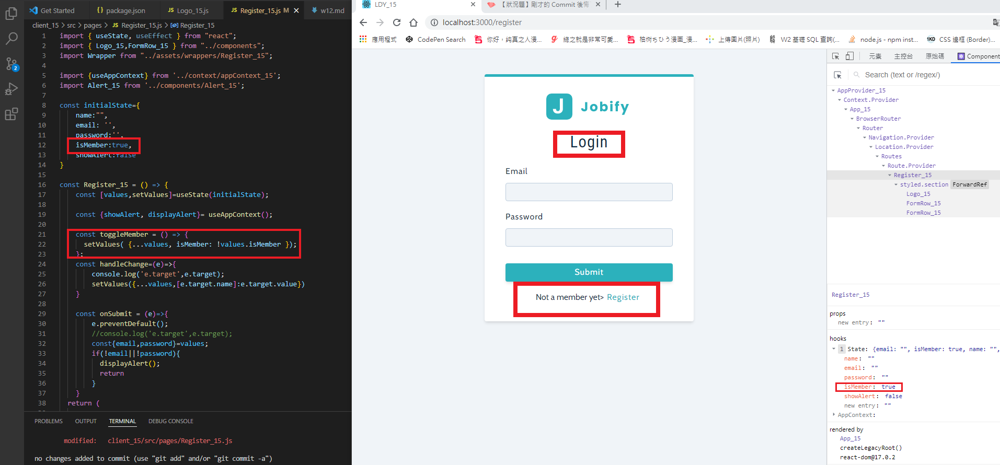

### w12-p1 switch Register and Login, and log

### w12-p2-1 test for notFoundMiddleware_xx.js 

### w12-p2-2 test for errorHandlerMiddleware_xx.js

### w12-p3  Use postman to test route /api/v1/auth_xx/register_xx

### w12-p4 Use postman to test route /api/v1/auth_xx/login_xx

### w12-p5 Use postman to test route /api/v1/auth_xx/updateUser_xx

### W12-LAST-LOG show all W12 log records in Github
