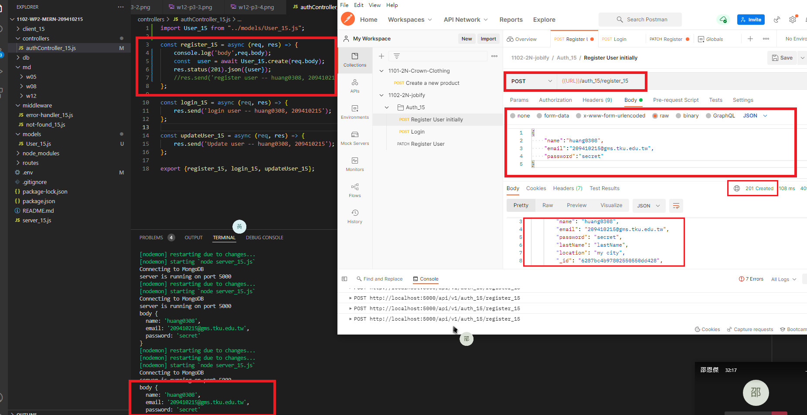
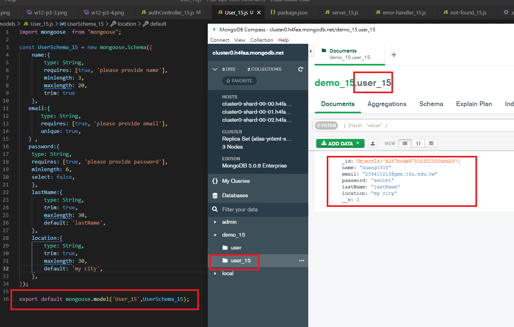
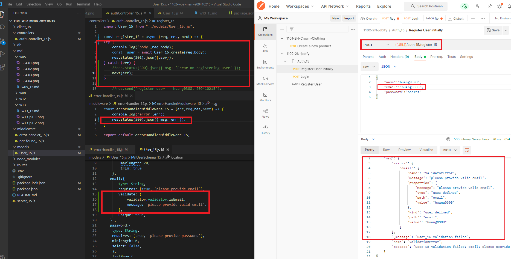
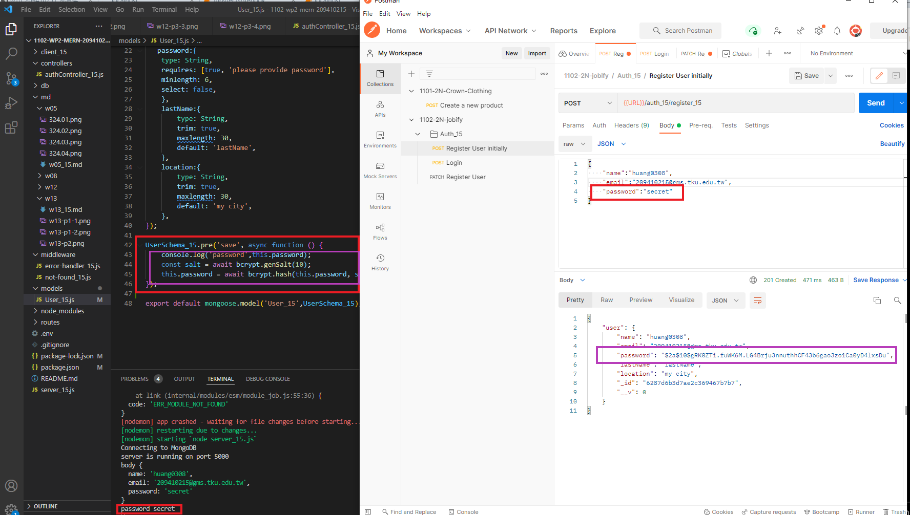
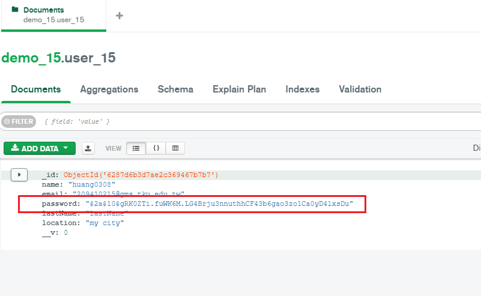
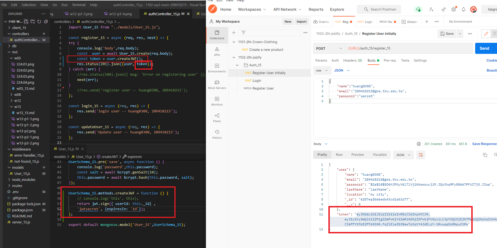
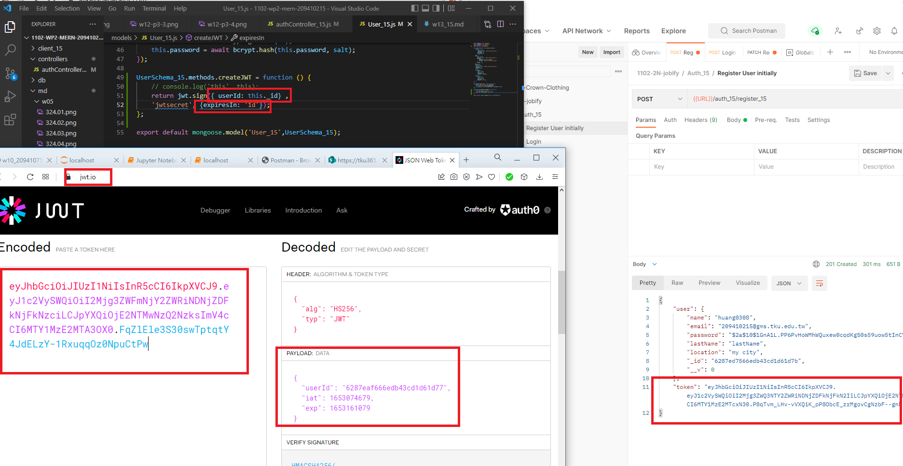

### w13-p1: create a user and save it into MongoDB, collection User_xx





### w13-p2: use validator package to check email, error sent to error-handler_xx.js



### w13-p3: hash password using bcryptjs





### w13-p4: create jwt token using bcryptjs






### p13-last-log


```
$  git log --pretty=format:"%h%x09%an%x09%ad%x09%s" --after="2022-05-18"
aa636c2 huang0308       Sat May 21 03:45:00 2022 +0800  w13-p4: create jwt token using bcryptjs
cc6a597 huang0308       Sat May 21 02:05:59 2022 +0800  w13-p3: hash password using bcryptjs
dbe619a huang0308       Sat May 21 01:34:41 2022 +0800  w13-p2: use validator package to check email, error sent to error-handler_xx.js
e37c872 huang0308       Sat May 21 00:50:40 2022 +0800  w13-p1: create a user and save it into MongoDB, collection User_xx
```