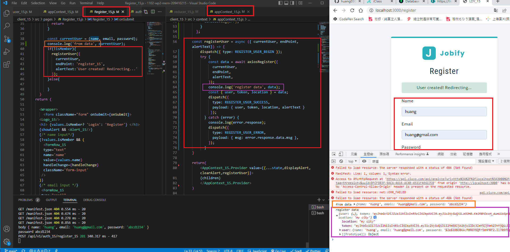
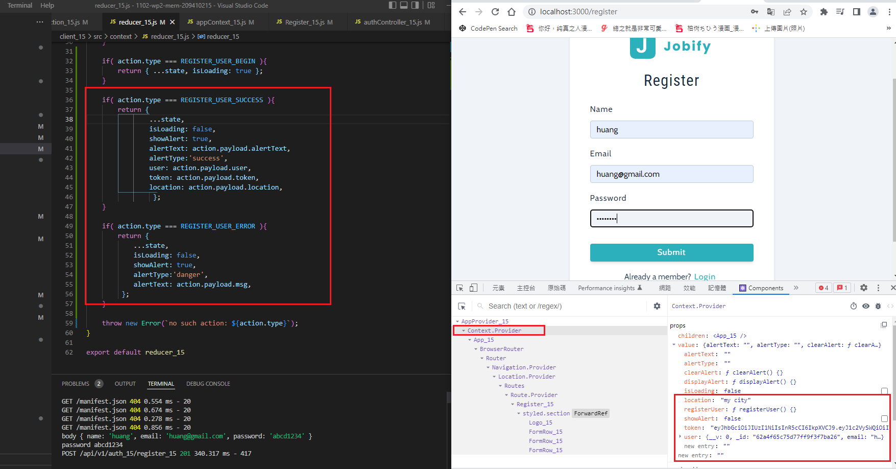
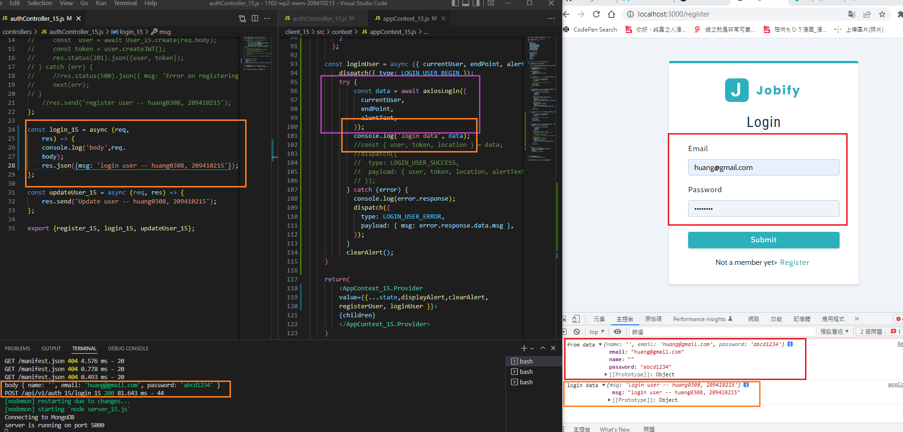
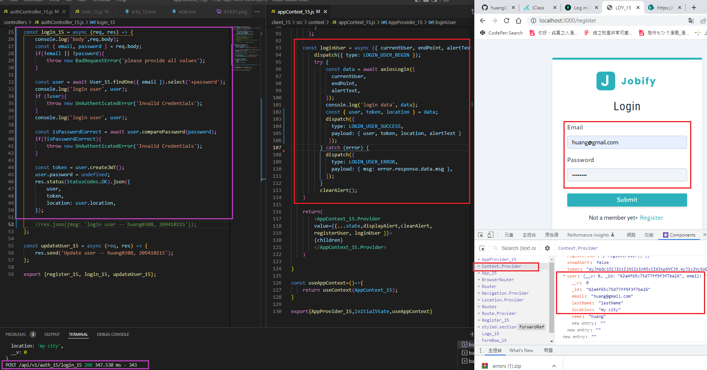
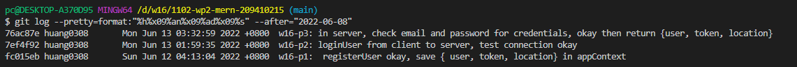

### w16-p1:  registerUser okay, save { user, token, location} in appContext





### w16-p2: loginUser from client to server, test connection okay



### w16-p3: in server, check email and password for credentials, okay then return {user, token, location}



### w16-last-log



```
$ git log --pretty=format:"%h%x09%an%x09%ad%x09%s" --after="2022-06-08"

76ac87e huang0308       Mon Jun 13 03:32:59 2022 +0800  w16-p3: in server, check email and password for credentials, okay then return {user, token, location}
7ef4f92 huang0308       Mon Jun 13 01:59:35 2022 +0800  w16-p2: loginUser from client to server, test connection okay
fc015eb huang0308       Sun Jun 12 04:13:04 2022 +0800  w16-p1:  registerUser okay, save { user, token, location} in appContext

```